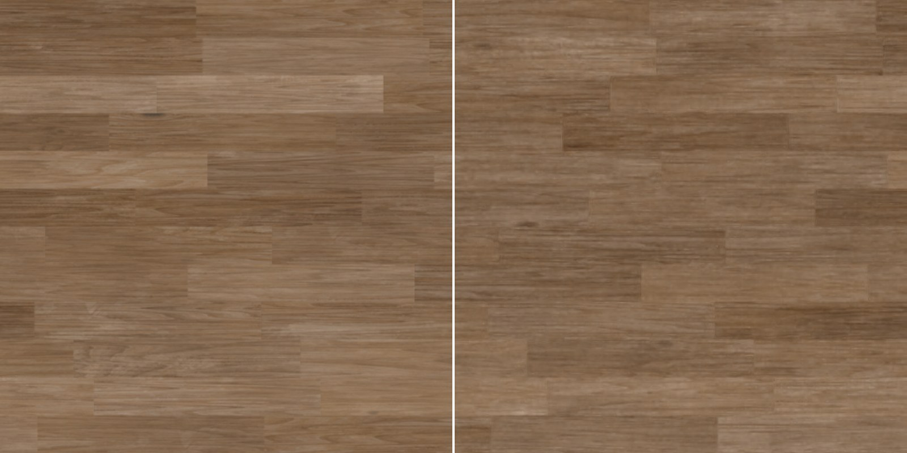

# Neural Texture Compression — PyTorch training + real-time WebGPU decoding

> Re-implementation (simplified) of **Vaidyanathan et al., [_Random-Access Neural Compression of Material Textures_](https://research.nvidia.com/labs/rtr/neural_texture_compression/), ACM TOG / SIGGRAPH 2023** ([paper](https://arxiv.org/abs/2305.17105)).
> A full PBR material (albedo, normal, roughness, AO…) is compressed jointly into two quantized latent grids + one tiny MLP, and decoded **per pixel on the GPU** (WebGPU).


<!-- TODO: link to the live demo on the portfolio -->

## Why this matters
Block compression formats (BC7, ASTC) encode every texture of a material separately, at a fixed rate
(8 bpp for BC7). Yet the albedo, normal, roughness and AO of one material are strongly correlated.
Neural texture compression encodes all of them jointly in shared latents and a small per-material
decoder, reaching higher quality at a lower bit rate while keeping random access, which is the property
GPUs need for texture sampling. The idea is moving towards production: NVIDIA ships it as the
[RTX Neural Texture Compression SDK](https://github.com/NVIDIA-RTX/RTXNTC) (still in beta as of
September 2026).

## Method
- **Input**: one material, `C` channels stacked (e.g. albedo 3 + normal 3 + roughness 1 + AO 1 = 8).
- **Latents**: two feature grids at 1/4 and 1/8 of the texture resolution, 8 features each,
  bilinearly sampled (texel-center convention, identical on CPU and GPU).
- **Decoder**: MLP `16 → 64 → 64 → C` with ReLU, shared by every texel.
- **Quantization-aware training**: float training, then uniform noise of one quantization step
  injected into the grids (last 40 % of steps), final hard quantization to `b` bits (2/4/8).
- **Bit rate**: `(grid values × b + MLP params × 16) / (H × W)` bits per pixel.
- **GPU decode** (`web/decode.wgsl`, compute pass): 2 × `F/4` array-texture lookups → MLP evaluated
  per screen pixel, weights repacked as `vec4` rows in a uniform buffer, loops specialized per MLP
  (`web/mlp.js`). The decode is cached and only re-run when zoom / pan / size change; lighting and
  the A/B split (`web/view.wgsl`) read the cache.
- **Correctness check**: with exact bilinear interpolation, the WGSL decoder matches the PyTorch
  reconstruction to within 1/255 (≈0.001 % of texels differ, rounding only). With the GPU's hardware
  bilinear filter (limited-precision weights), differences reach 2–4/255.

```
uv ──► grid 0 (1/4 res, 8 feats) ──┐
   └─► grid 1 (1/8 res, 8 feats) ──┴─► concat (16) ─► MLP 16→64→64→C ─► C channels
```

## Results
Material: [WoodFloor051](https://ambientcg.com/view?id=WoodFloor051) from ambientCG (CC0), 2K maps
resized to 1024², 8 channels (AO 1 + albedo 3 + normal GL 3 + roughness 1). Default settings
(`--feats 8 8 --scales 4 8`, 4000 steps). The baseline downsamples every map to the same bit rate and
upsamples it bilinearly. PSNR in dB.

| Setting | bpp | Ratio vs 8-bit | PSNR all | Albedo | Normal | Roughness | AO |
|---|---|---|---|---|---|---|---|
| Neural, 4-bit latents | 2.59 | ×24.7 | **38.92** | **36.75** | **44.70** | **37.02** | **40.40** |
| Downsample baseline (206², 2.59 bpp) | 2.59 | ×24.7 | 34.20 | 32.35 | 42.68 | 32.56 | 32.37 |
| Neural, 2-bit latents | 1.34 | ×47.8 | **34.28** | **31.89** | 42.37 | **33.25** | **34.01** |
| Downsample baseline (148², 1.34 bpp) | 1.34 | ×47.8 | 33.58 | 31.62 | 42.37 | 32.02 | 31.91 |

At 4 bits the neural codec beats the baseline by +4.7 dB overall (+4.4 dB on albedo). At 2 bits the gap
shrinks to +0.7 dB. BC7 is not compared yet (no encoder in the pipeline).

Decode cost: `__ ms / frame` at 1080p on `<GPU>` (viewer "Benchmark" button: 100 full decodes, every
pixel runs the MLP, coarse CPU-side timing).

## Differences from the paper (honest scope)
- No mip-mapping: the paper trains one latent pyramid for all mip levels — here level 0 only.
- No positional encoding of the in-cell position (paper uses one).
- MLP weights stored as fp32 in the demo (fp16 assumed in the bit-rate count); no tensor-core / cooperative-vector inference.
- Latents stored in 8-bit textures (values lie exactly on the 2/4-bit grid; real bit-packing not implemented).
- Simple Blinn-Phong shading in the viewer instead of full GGX.

## Future work
- Mip levels: one latent pyramid for the whole mip chain, as in the paper.
- Texture filtering: stochastic / anisotropic filtering of decoded texels (only bilinear latents today).
- Faster inference: f16 packed weights, cooperative-vector / tensor-core matrix ops where available.
- Real baselines: BC7 / ASTC at matched bit rates, and a rate–distortion curve over `--bits`, `--feats`, `--scales`.
- Compare with follow-up work and with the [RTXNTC SDK](https://github.com/NVIDIA-RTX/RTXNTC).
<!-- TODO: cite 1–3 follow-up papers you actually read. -->

## Run it
```bash
pip install -r requirements.txt
# one material folder (e.g. ambientCG 2K PNG): keep ONE normal map (GL convention)
python train.py --material path/to/Material_2K --res 1024 --bits 4 --out web/data
python -m http.server -d web 8000        # then open http://localhost:8000 (Chrome/Edge, WebGPU)
```
Smoke test without data: `python train.py --synthetic --res 256 --steps 300 --out web/data`.

## Reference
K. Vaidyanathan, M. Salvi, B. Wronski, T. Akenine-Möller, P. Ebelin, A. Lefohn.
*Random-Access Neural Compression of Material Textures.* ACM Transactions on Graphics 42(4), SIGGRAPH 2023.
[DOI 10.1145/3592407](https://doi.org/10.1145/3592407) · [arXiv:2305.17105](https://arxiv.org/abs/2305.17105) ·
[NVIDIA Research project page](https://research.nvidia.com/labs/rtr/neural_texture_compression/)
