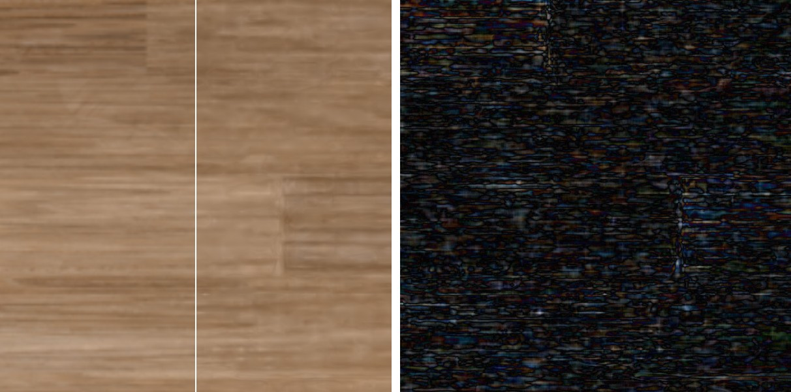
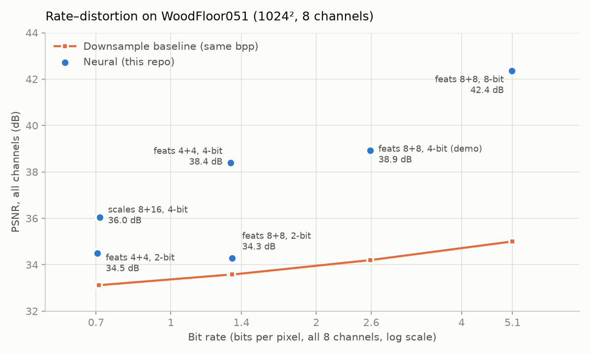

# Neural Texture Compression — PyTorch training + real-time WebGPU decoding

> Re-implementation (simplified) of **Vaidyanathan et al., [_Random-Access Neural Compression of Material Textures_](https://research.nvidia.com/labs/rtr/neural_texture_compression/), ACM TOG / SIGGRAPH 2023** ([paper](https://arxiv.org/abs/2305.17105)).
> A full PBR material (albedo, normal, roughness, AO…) is compressed jointly into two quantized latent grids + one tiny MLP, and decoded **per pixel on the GPU** (WebGPU).


*"Lit" view, zoom ×2, 1600×800. Left of the line: original maps; right: neural decode (4-bit latents, 2.59 bpp).*


*Zoom ×6. Left: "Albedo" view, original | neural. Right: "|Error| albedo ×8" view. The error concentrates
on board seams and fine grain, which the 1/4- and 1/8-resolution latents smooth out.*
<!-- TODO: link to the live demo on the portfolio -->

## Why this matters
Block compression formats (BC7, ASTC) encode every texture of a material separately, at a fixed rate
(8 bpp for BC7). Yet the albedo, normal, roughness and AO of one material are strongly correlated.
Neural texture compression encodes all of them jointly in shared latents and a small per-material
decoder while keeping random access, which is the property GPUs need for texture sampling. The paper
reports higher quality than BC-style formats at lower bit rates (this repo does not compare against BC7
yet: see Results). The idea is moving towards production: NVIDIA ships it as the
[RTX Neural Texture Compression SDK](https://github.com/NVIDIA-RTX/RTXNTC) (latest release v0.10.0,
still labelled beta, August 2026).

## Method
- **Input**: one material, `C` channels stacked (e.g. albedo 3 + normal 3 + roughness 1 + AO 1 = 8).
- **Latents**: two feature grids at 1/4 and 1/8 of the texture resolution, 8 features each,
  bilinearly sampled (texel-center convention, identical on CPU and GPU).
- **Decoder**: MLP `16 → 64 → 64 → C` with ReLU, shared by every texel.
- **Quantization-aware training**: float training, then uniform noise of one quantization step
  injected into the grids (last 40 % of steps), final hard quantization to `b` bits (2/4/8).
- **Bit rate**: `(grid values × b + MLP params × 16) / (H × W)` bits per pixel.
- **GPU decode** (`web/decode.wgsl`, compute pass): 2 × `F/4` array-texture lookups → MLP evaluated
  per screen pixel, weights repacked as `vec4` rows in a uniform buffer, loops specialized per MLP
  (`web/mlp.js`). The decode is cached and only re-run when zoom / pan / size change; lighting and
  the A/B split (`web/view.wgsl`) read the cache.
- **Correctness check**: with exact bilinear interpolation, the WGSL decoder matches the PyTorch
  reconstruction to within 1/255 (≈0.001 % of texels differ, rounding only). With the GPU's hardware
  bilinear filter (limited-precision weights), differences reach 2–4/255.

```
uv ──► grid 0 (1/4 res, 8 feats) ──┐
   └─► grid 1 (1/8 res, 8 feats) ──┴─► concat (16) ─► MLP 16→64→64→C ─► C channels
```

## Results
Material: [WoodFloor051](https://ambientcg.com/view?id=WoodFloor051) from ambientCG (CC0), 2K maps
resized to 1024², 8 channels (AO 1 + albedo 3 + normal GL 3 + roughness 1). Default settings
(`--feats 8 8 --scales 4 8`, 4000 steps). The baseline downsamples every map to the same bit rate and
upsamples it bilinearly. PSNR in dB.

| Setting | bpp | Ratio vs 8-bit | PSNR all | Albedo | Normal | Roughness | AO |
|---|---|---|---|---|---|---|---|
| Neural, 4-bit latents | 2.59 | ×24.7 | **38.92** | **36.75** | **44.70** | **37.02** | **40.40** |
| Downsample baseline (206², 2.59 bpp) | 2.59 | ×24.7 | 34.20 | 32.35 | 42.68 | 32.56 | 32.37 |
| Neural, 2-bit latents | 1.34 | ×47.8 | **34.28** | **31.89** | 42.37 | **33.25** | **34.01** |
| Downsample baseline (148², 1.34 bpp) | 1.34 | ×47.8 | 33.58 | 31.62 | 42.37 | 32.02 | 31.91 |

At 4 bits the neural codec beats the baseline by +4.7 dB overall (+4.4 dB on albedo). At 2 bits the gap
shrinks to +0.7 dB. BC7 is not compared yet (no encoder in the pipeline).

### Rate–distortion



| Config (`--feats` / `--scales` / `--bits`) | bpp | PSNR all (dB) | Baseline, same bpp (dB) | Gain |
|---|---|---|---|---|
| 4+4 / 4 8 / 2-bit | 0.71 | 34.50 | 33.10 | +1.4 |
| 8+8 / 8 16 / 4-bit | 0.71 | 36.03 | 33.12 | +2.9 |
| 4+4 / 4 8 / 4-bit | 1.33 | 38.39 | 33.58 | +4.8 |
| 8+8 / 4 8 / 2-bit | 1.34 | 34.28 | 33.58 | +0.7 |
| 8+8 / 4 8 / 4-bit (demo) | 2.59 | 38.92 | 34.20 | +4.7 |
| 8+8 / 4 8 / 8-bit | 5.09 | 42.35 | 35.00 | +7.4 |

At a fixed budget, **latent precision matters more than latent count**. At ~1.33 bpp, 4 features at
4 bits reach 38.4 dB, versus 34.3 dB for 8 features at 2 bits. At ~0.71 bpp, coarser grids at 4 bits
(36.0 dB) beat fewer features at 2 bits (34.5 dB). With this QAT scheme, 2-bit quantization is where
quality collapses.

Decode cost: **67.3 ms / frame at 1080p on an Intel Iris Xe** (integrated laptop GPU), measured with the
viewer's "Benchmark" button: 100 full decodes where every pixel runs the MLP, coarse CPU-side timing.
That is 2.07 M pixels × 5,632 multiply-adds ≈ 23 GFLOP per frame, or ~350 GFLOP/s effective in fp32.
The viewer stays interactive because it caches the decode and only re-runs it on zoom / pan / resize.

## Differences from the paper (honest scope)
- No mip-mapping: the paper trains one latent pyramid for all mip levels — here level 0 only.
- No positional encoding of the in-cell position (paper uses one).
- MLP weights stored as fp32 in the demo (fp16 assumed in the bit-rate count); no tensor-core / cooperative-vector inference.
- Latents stored in 8-bit textures (values lie exactly on the 2/4-bit grid; real bit-packing not implemented).
- Simple Blinn-Phong shading in the viewer instead of full GGX.

## Future work
- Mip levels: one latent pyramid for the whole mip chain, as in the paper.
- Texture filtering: stochastic / anisotropic filtering of decoded texels (only bilinear latents today).
- Faster inference: f16 packed weights, cooperative-vector / tensor-core matrix ops where available.
- Real baselines: BC7 / ASTC at matched bit rates; more materials than one wood floor.
- Compare with follow-up work and with the [RTXNTC SDK](https://github.com/NVIDIA-RTX/RTXNTC).
<!-- TODO: cite 1–3 follow-up papers you actually read. -->

## Run it
The trained demo data is committed in `web/data/`, so the viewer runs without training:
```bash
python -m http.server -d web 8000        # then open http://localhost:8000 (Chrome/Edge, WebGPU)
```
To retrain, download [WoodFloor051 (2K-JPG)](https://ambientcg.com/view?id=WoodFloor051) from ambientCG
(CC0) and unzip it into `2ktexture/` (any material folder with ONE normal map, GL convention, works):
```bash
uv sync
uv run train.py --material 2ktexture --res 1024 --bits 4 --out web/data
```
The viewer is deployed to GitHub Pages by `.github/workflows/pages.yml` on every push that touches `web/`.

Smoke test without data: `uv run train.py --synthetic --res 256 --steps 300 --out /tmp/ntc_test`.

## Reference
K. Vaidyanathan, M. Salvi, B. Wronski, T. Akenine-Möller, P. Ebelin, A. Lefohn.
*Random-Access Neural Compression of Material Textures.* ACM Transactions on Graphics 42(4), SIGGRAPH 2023.
[DOI 10.1145/3592407](https://doi.org/10.1145/3592407) · [arXiv:2305.17105](https://arxiv.org/abs/2305.17105) ·
[NVIDIA Research project page](https://research.nvidia.com/labs/rtr/neural_texture_compression/)
